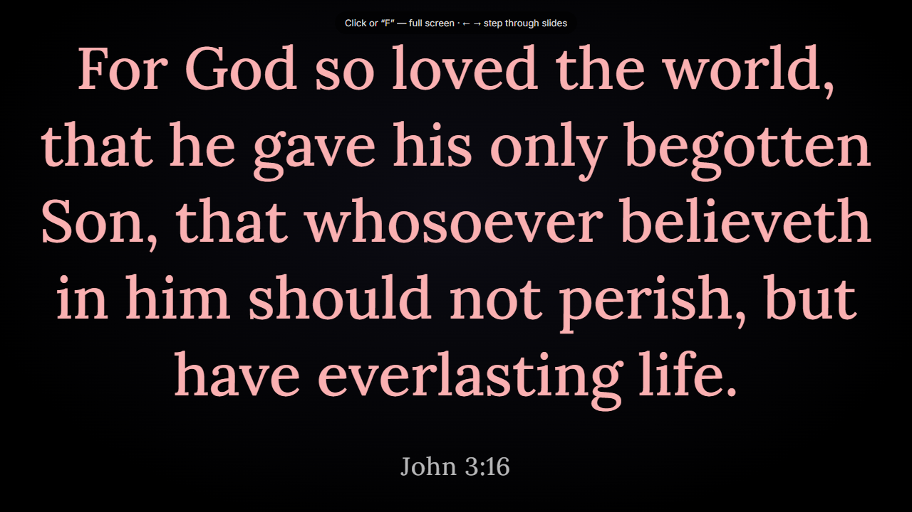

# Quick start

[Українською](../quickstart.md) · English

This guide takes you from starting VerseOrchestrator to the first verse on a second
screen. It takes about 10 minutes; the first start can take a few minutes longer, because
the app builds its library. Search, songs, the running order, and viewers' phones are
described in other parts of the [documentation](README.md).

## Before you begin

For this guide you need:

- a computer with Windows, macOS, or Linux and the Chrome or Edge browser;
- the app extracted from the archive for your system — see
  [Download the app](install.md#download-the-app);
- MyBible modules with Bible translations (`*.SQLite3` files) in the app's `modules/`
  folder.

A second monitor or a projector is optional: the presentation window works on one screen
too. More about the requirements is in [Install and start](install.md#requirements).

## Start the app

To start VerseOrchestrator, open its folder and:

- on Windows, double-click `start.cmd`;
- on macOS, double-click `start.command`;
- on Linux, run `./start.sh` in a terminal.

The start window opens. On the first start it builds the library from the modules — from
a few seconds to a few minutes. When everything is ready, the control window opens in the
browser, and the start window shows the addresses:

```text
✓ The app is running (0.7 s). Control window: http://localhost:4747
  Phones on the same Wi-Fi network: http://192.168.0.80:4747/follow
  To stop: Ctrl+C or close this window.
```

Keep the start window open while you work: the app stops with it.

## Choose a translation and a verse

To choose a verse:

1. On the left, in the **Translations** list, select a translation, for example **KJV**.
2. Below the translations, choose a book, and above the verses, the chapter number.
3. In the verse list, click the verse. To add more verses, click while holding Ctrl (on
   macOS, ⌘).

On the right, the **Preview** monitor shows the slide — how the verse will look on screen.


To jump to a place quickly, type a reference in the **Go to** field at the top, for
example `John 3:16`, and press Enter.

## Open the presentation window

To open the presentation window:

1. At the top, click **Presentation window**.
   If a second screen is connected, the browser asks for permission to manage windows on
   all your screens. Allow it, and the presentation window opens on the second screen.
2. To make the presentation window full screen, click in it or press F.

In a narrow window, some of the buttons at the top move into the **More** menu (three dots
at the right), where **Presentation window** is called **Open the presentation window**. See
[Buttons at the top of the control window](reference.md#buttons-at-the-top-of-the-control-window).

## Show the verse

To show the chosen verse, click **To screen** at the top or press F5 (on macOS, ⌘↩). The
verse appears in the presentation window, and the monitor on the right gets a red frame
and the **On screen** label.



Next:

- To show the next verse, press → or ↓; the previous one, ← or ↑. While the **Live**
  switch is on, the screen follows the selection at once.
- To take the text off the screen, press Esc.

## Stop the app

To stop the app, close the start window.

To switch everything off, including the start with the computer, open **Settings** →
**App** in the control window and click **Switch off completely…**.

## What's next

- [Find a text](find-text.md): several translations, search by words, history.
- [Show a text](show-text.md): stepping through, hidden text, output windows, the stage
  display.
- [Troubleshooting](troubleshooting.md): messages of the start window and other problems.
- [VerseOrchestrator documentation](README.md): the contents of all parts.
