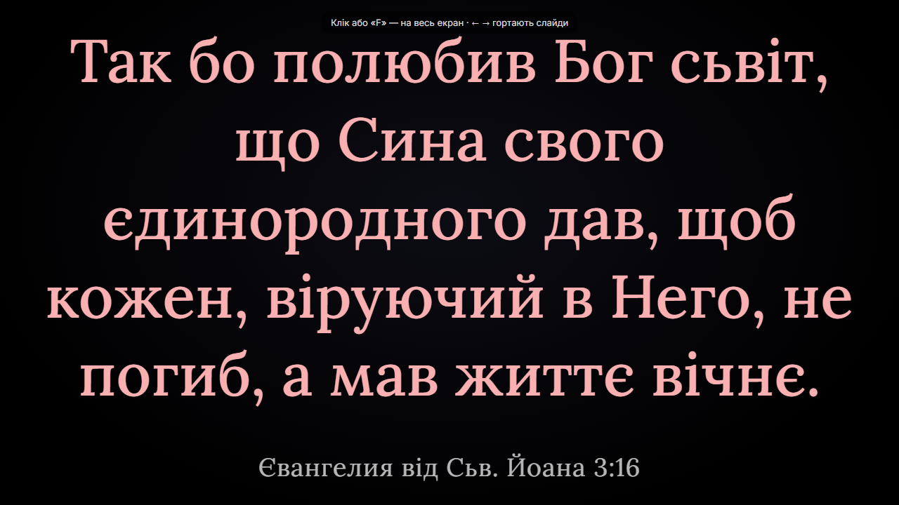

# Швидкий старт

Українською · [English](en/quickstart.md)

За цим посібником ви запустите VerseOrchestrator і покажете перший вірш на другому
екрані. Це займає близько 10 хвилин; перший запуск може тривати на кілька хвилин довше,
бо застосунок збирає бібліотеку. Пошук, пісні, послідовність показу й телефони глядачів описано в
інших розділах [документації](README.md).

## Перед початком

Для цього посібника потрібні:

- комп’ютер з Windows, macOS або Linux і браузер Chrome або Edge;
- застосунок, розпакований з архіву для вашої системи — див.
  [Завантажте застосунок](install.md#завантажте-застосунок);
- модулі MyBible з перекладами Біблії (файли `*.SQLite3`) у папці `modules/` застосунку.

Другий монітор або проєктор — за бажанням: вікно показу працює й на одному екрані.
Докладніше про вимоги — у розділі [Встановлення й запуск](install.md#вимоги).

## Запустіть застосунок

Щоб запустити VerseOrchestrator, відкрийте його папку й:

- у Windows двічі клацніть `start.cmd`;
- у macOS двічі клацніть `start.command`;
- у Linux виконайте в терміналі `./start.sh`.

Відкривається вікно запуску. Під час першого запуску воно збирає бібліотеку з модулів —
від кількох секунд до кількох хвилин. Коли все готово, у браузері відкривається вікно
керування, а у вікні запуску з’являються адреси:

```text
✓ Застосунок працює (0.7 с). Вікно керування: http://localhost:4747
  Телефони в тій самій мережі Wi-Fi: http://192.168.0.80:4747/follow
  Зупинити: Ctrl+C або закрийте це вікно.
```

Не закривайте вікно запуску, доки працюєте: разом із ним зупиняється застосунок.

## Виберіть переклад і вірш

Щоб вибрати вірш:

1. Ліворуч, у списку **Переклади**, позначте переклад, наприклад **UKRK** (Куліш).
2. Під списком перекладів виберіть книгу, а над віршами — номер розділу.
3. У списку віршів клацніть потрібний вірш. Щоб додати ще вірші, клацайте з натиснутою
   клавішею Ctrl (у macOS — ⌘).

Праворуч, на моніторі **Прев’ю**, з’являється слайд — так вірш виглядатиме на екрані.


Щоб швидко перейти до місця, введіть посилання в поле **Перейти** вгорі, наприклад
`Ів 3:16`, і натисніть Enter.

## Відкрийте вікно показу

Щоб відкрити вікно показу:

1. Угорі натисніть **Вікно показу**.
   Якщо під’єднано другий екран, браузер спитає дозволу керувати вікнами на всіх екранах.
   Дозвольте — і вікно показу відкриється на другому екрані.
2. Щоб розгорнути вікно показу на весь екран, клацніть у ньому або натисніть F.

У вузькому вікні частина кнопок угорі переходить у меню **Ще** (три крапки праворуч), а
**Вікно показу** там називається **Відкрити вікно показу**. Докладніше — [Кнопки вгорі
вікна керування](reference.md#кнопки-вгорі-вікна-керування).

## Покажіть вірш

Щоб показати вибраний вірш, угорі натисніть **На екран** або клавішу F5 (у macOS — ⌘↩).
Вірш з’являється у вікні показу, а монітор праворуч отримує червону рамку й позначку
**На екрані**.



Далі:

- Щоб показати наступний вірш, натисніть → або ↓; попередній — ← або ↑. Поки увімкнено
  перемикач **Наживо**, екран одразу повторює вибір.
- Щоб прибрати текст з екрана, натисніть Esc.

## Зупиніть застосунок

Щоб зупинити застосунок, закрийте вікно запуску.

Щоб вимкнути все повністю, разом з автозапуском, у вікні керування відкрийте
**Налаштування вигляду** → **Застосунок** і натисніть **Вимкнути повністю…**.

## Що далі

- [Як знайти текст](find-text.md): кілька перекладів, пошук за словами, історія.
- [Як показати текст](show-text.md): гортання, схований текст, вікна виводу, сцена.
- [Якщо щось не працює](troubleshooting.md): повідомлення вікна запуску й інші проблеми.
- [Документація VerseOrchestrator](README.md): зміст усіх розділів.
